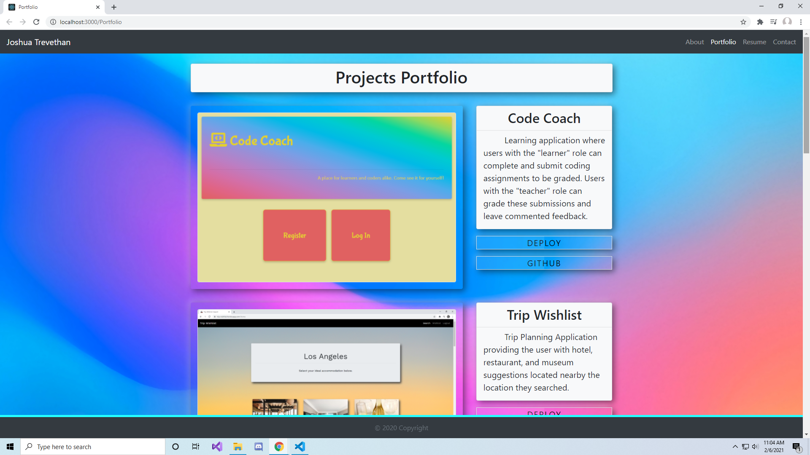

# Portfolio

This portfolio was created using React.js. It is a one page application build to look like a multiple page application through the use of React.js changing content in real time when different category tabs are clicked. The user is able to view my About Me page, my Portfolio page, my Resume page and my Contact Me page. The About Me page gives the user a picture of myself and a short discription. The Portfolio page displays 7 of my GitHub projects which, when clicked, open a new tab for the user to the related project. The Resume page contains my Technical Skills and my Resume. The final page is a Contact Me page allowing the user to send me an email by filling out a form and hitting the submission button.

## Link

https://joshtrev.github.io/Portfolio/

