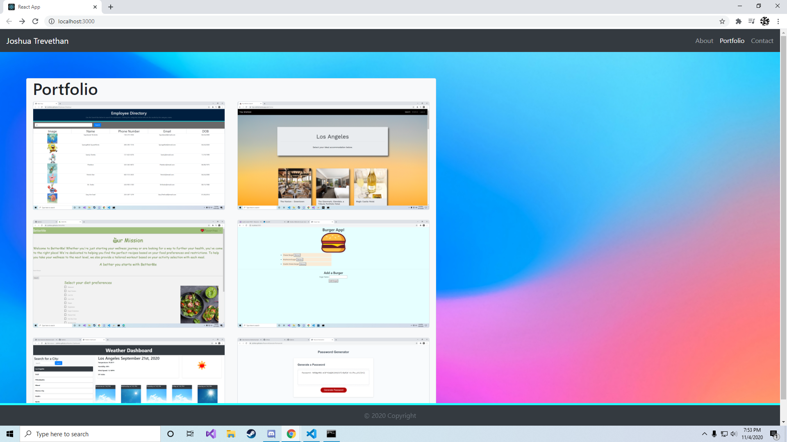

# Portfolio

This portfolio was created using React.js. It is a one page application build to look like a multiple page application through the use of React.js changing content in real time when different category tabs are clicked. The user is able to view my About Me page, my Portfolio page, and my Contact Me page. The About Me page gives the user a picture of myself and a short discription. The Portfolio page displays 6 of my GitHub projects which, when clicked, open a new tab for the user to the related project. The final page is currently a work in progress Contact Me page that the user will be able to use to contact me by filling out a form.

## Link

https://joshtrev.github.io/Portfolio/

